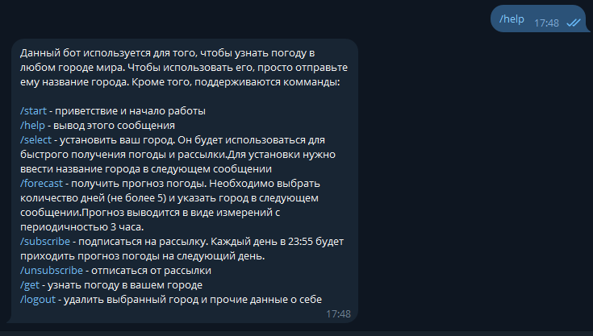
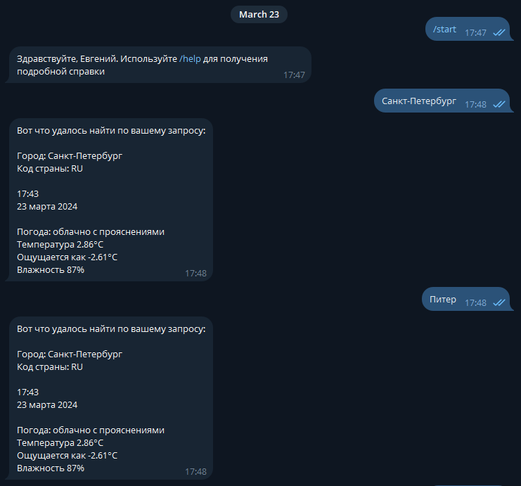
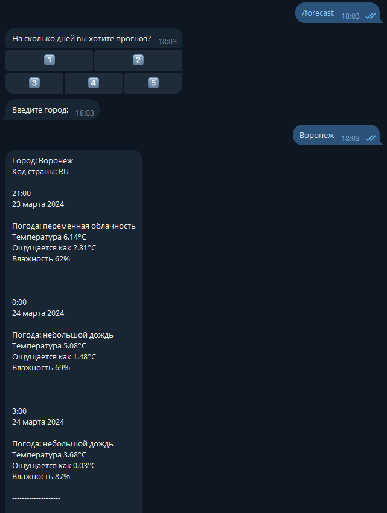
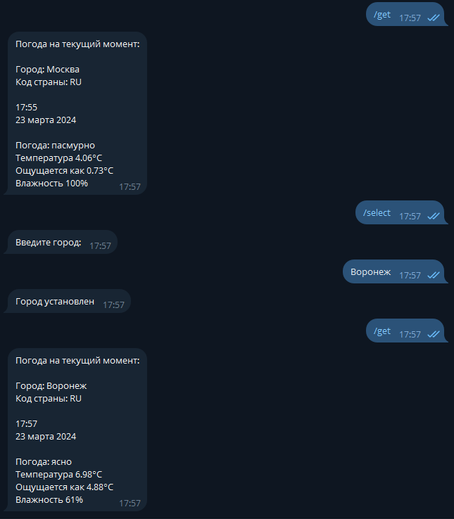
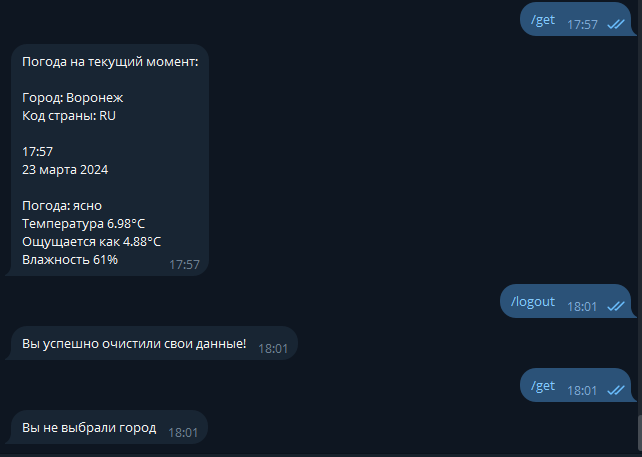

# Telegram-бот для мониторинга и прогноза погоды
С помощью данного бота можно узнать погоду в любом городе мира на данный момент, 
либо посмотреть прогноз (максимум на 5 дней). Кроме того, можно выбрать свой город, чтобы 
не писать его каждый раз, а также подписаться на ежедневную рассылку прогноза погоды.

Бот использует погодный API сайта [OpenWeather](https://openweathermap.org/).
Сначала название города переводится в координаты (с помощью *Geocoding API*),
а затем по координатам определяется погода (**Current Weather API** для текущей погоды 
и **3-hour Forecast 5 days** для прогноза).

Если пользователь выбирает город или подписывается на рассылку, то он сохраняется в базу данных 
(при помощи Hibernate и Spring Data JPA).

Кроме того, проект можно запустить с помощью `docker compose`, в котором будет 2 контейнера:
само приложение и база данных пользователей.

## Примеры использования бота:
### Информационное сообщение:

### Простой пример:

### Прогноз погоды на 1 день (сообщение показано не полностью):

### Пример с get:

### Рассылка:

### Пример с logout:
